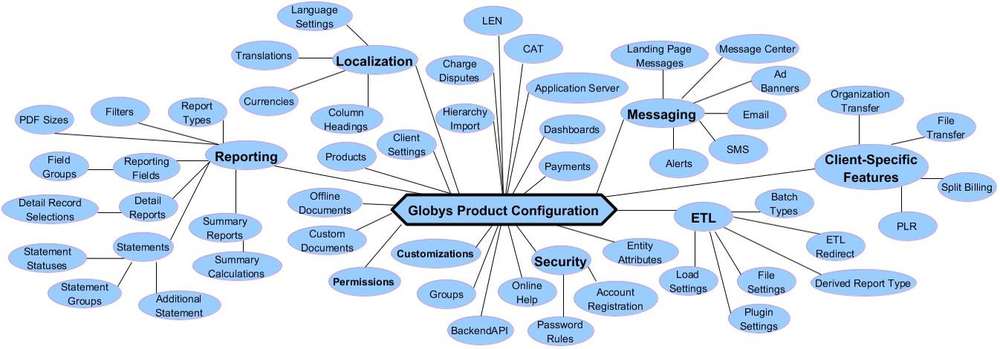

## **Mark Strickland**

[](https://github.com/MarkStrickland562)

[**MarkStrickland562**](https://github.com/MarkStrickland562)

## **Globys G3 Configuration Tool**

###### Started May 10, 2019.

---

## Project Description

The _Globys G3 Configuration Tool_ is a prototype project for developing a configuration tool for the Globys G3 product. G3 Configuration is a very large, complex body of data and business rules that controls G3 functionality and the user experience. There are 51 areas of configuration and most "configurables" fall under the categories of Reporting, Permissions, Customizations, Client System Settings, Localization, Messaging and Security. There are ~160 database tables that contain configuration data. At least 60 must be populated correctly in order for G3 to be fully functional. The Minimal Viable Product for this project will focus on Permissions and Customizations which will also include configuration of Clients, Products and Groups. The other configurables will be represented in disabled buttons in a navigation bar in order to provide a view into what a fully-featured tool would look like. Minimum features will include:

- Enable Create/Read/Update/Delete operations for Clients, Products and Groups.
- Enable configuration product permissions at the Client, Product, Product/UserType and Group levels.
- Enable product customizations at the Client, Product and Group levels.

At the very least, the project will use Firebase for data persistence and project deployment with the possibility of using a relational database management system for data persistence (mySQL or SQL Server). In addition, C#/MVC may be used for a service layer. React/Redux will be used the User Interface and for managing State.

The data model will consist of 14 database tables (or JSON objects, depending on how the data is persisted). There of those are reference tables (lookup tables) and the other 11 are transactional tables.

Beyond the Minimal Viable Product, the following features could be added:

- Configuration of reporting fields.
- Configuration of Detail Reports.
- Configuration of Summary Calculations and Summary Reports.

## Business Rules

- A "Client" is a Globys customer.
- A "Product" is a container for G3 features, permissions, customizations, etc.
- "User Types" are 1=admin user, 2=regular user, 3=customer service user.
- "Groups" are named groupings of Globys customers' customers and their accounts.
- "Permissions" control what users can do and see in G3 and can be applied at the Client level, to one or more Products, to one or more User Types for each product and to one or more Groups.
- "Customizations" are used for customizing the behavior and appearance of the application and can be applied at the Client level, to one or more Products and to one or more Groups.

## The Universe of Globys G3 Configuration



## Component Tree

App
<br>
----> Main ("/")
<br>
--------> Header
<br>
--------> TopNav
<br>
--------> Show Client Information ("/showclients")
<br>
--------> Add Client Information ("/addclient")
<br>
--------> Edit Client Information ("/editclient")
<br>
--------> Delete Client Information ("/deleteclient")
<br>
--------> Show Products ("/showproducts")
<br>
--------> Add Products ("/addproduct")
<br>
--------> Edit Products ("/editproduct")
<br>
--------> Delete Products ("/deleteproduct")
<br>
--------> Configure Permissions ("/configurepermissions")
<br>
--------> Configuration Customizations ("/configurecustomizations")
<br>
--------> About ("/about")
<br>
--------> Error404
<br>

## Database Tables

<details>
<summary>Click Here for Details</summary>
<table>
    <tr>
        <th>Table Name</th>
        <th>Column Name</th>
        <th>Data Type</th>
    </tr>
    <tr>
        <td>clients</td>
        <td>client_id<br>nme<br>encrypt_key<br>external_id<br>client_ad_nme<br>login<br>password<br>validation_question_1<br>validation_question_2<br>validation_question_3<br>validation_question_4<br>validation_question_5<br>preproc_min<br>default_language_id<br>default_currency_id<br>default_currency_use_symbol<br>default_email_address<br>public_encryption_key<br>public_encryption_type<br>user_acct_flg<br>pwd_history_count<br>min_pwd_days<br>max_pwd_days<br>sso_redirect_url<br>cat_acct_search_type<br>sso_redirect_querystring_flg</td>
        <td>smallint<br>nvarchar(80)<br>nvarchar(510)<br>int<br>nvarchar(60)<br>nvarchar(100)<br>nvarchar(100)<br>nvarchar(2000)<br>nvarchar(2000)<br>nvarchar(2000)<br>nvarchar(2000)<br>nvarchar(2000)<br>int<br>tinyint<br>smallint<br>tinyint<br>nvarchar(160)<br>nvarchar(8000)<br>smallint<br>tinyint<br>int<br>int<br>int<br>nvarchar(2048)<br>tinyint<br>tinyint</td>
    </tr>
    <tr>
        <td>products</td>
        <td>product_id<br>product_name<br>client_id<br>display_name<br>display_order<br>display_help_text<br>product_code<br>piv_flg</td>
        <td>int<br>nvarchar(8000)<br>smallint<br>nvarchar(8000)<br>tinyint<br>nvarchar(8000)<br>nvarchar(8000)<br>tinyint<br></td>
    </tr>
    <tr>
        <td>groups</td>
        <td>group_id<br>group_name<br>client_id<br>viewable_flg<br>group_priority</td>
        <td>int<br>nvarchar(8000)<br>smallint<br>tinyint<br>smallint</td>
    </tr>
    <tr>
        <td>permissions</td>
        <td>permission_id<br>nme<br>type<br>user_flg<br>permission_category_id<br>description<br>permission_description</td>
        <td>smallint<br>nvarchar(8000)<br>nchar<br>bit<br>int<br>nvarchar(8000)<br>nvarchar(8000)</td>
    </tr>
    <tr>
        <td>permission_categories</td>
        <td>permission_category_id<br>permission_category_name<br>display_order</td>
        <td>int<br>nvarchar(8000)<br>int</td>
    </tr>
    <tr>
        <td>client_permission</td>
        <td>client_id<br>permission_id</td>
        <td>smallint<br>smallint</td>
    </tr>
    <tr>
        <td>product_permission</td>
        <td>product_id<br>permission_id</td>
        <td>int<br>smallint</td>
    </tr>
    <tr>
        <td>product_permission_user_type</td>
        <td>product_id<br>permission_id<br>user_type</td>
        <td>int<br>int<br>int</td>
    </tr>
    <tr>
        <td>group_permission</td>
        <td>group_id<br>permission_id</td>
        <td>int<br>smallint</td>
    </tr>
    <tr>
        <td>custom_values</td>
        <td>custom_value_id<br>custom_type_id<br>description<br>char_value<br>num_value<br>default_value</td>
        <td>int<br>smallint<br>nvarchar(8000)<br>nvarchar(8000)<br>numeric<br>bit</td>
    </tr>
    <tr>
        <td>custom_types</td>
        <td>custom_type_id<br>custom_type_name<br>custom_input_type<br>custom_type_category_id<br>custom_type_description</td>
        <td>smallint<br>nvarchar(8000)<br>nchar<br>int<br>nvarchar(8000)</td>
    </tr>
    <tr>
        <td>client_custom_value</td>
        <td>client_id<br>custom_value_id<br>custom_type_id</td>
        <td>smallint<br>int<br>smallint</td>
    </tr>
    <tr>
        <td>product_custom_value</td>
        <td>product_id<br>custom_value_id<br>custom_type_id</td>
        <td>int<br>int<br>smallint</td>
    </tr>
    <tr>
        <td>group_custom_value</td>
        <td>group_id<br>custom_value_id<br>custom_type_id<br>intersect_custom_value_id</td>
        <td>int<br>int<br>smallint<br>int</td>
    </tr>
</table>
</details>

## Technical Features

- Bootstrap
- React
- Eslint

## Known Bugs

No Known Bugs.

## Project Plan

##### 1) Develop technical architecture.

##### 2) Set up the project.

<details>
<summary>Click Here for Details</summary>
This assumes that node is already installed, but verify with "node -v".
<br><br>
1) Setup the project by executing the following commands at the bash prompt:
<br><br>
    $ npm install bootstrap --save
<br><br>
2) Populate .gitignore with:
<br><br>
    node_modules/
<br>
    .DS_Store
<br>
    dist/
<br>
    .env
<br><br>
</details>

##### 3) Develop mocked-up screenshots to show the UI model.

##### 4) Obtain reference data from a Globys database.

##### 5) Develop mock data for the 11 transactional tables.

##### 6) Create components for showing, adding, editing and deleting data.

## Setup and Use

#### Required Packages

<details>
<summary>Click Here for Required Packages</summary>
<ul>
<li>babel-core 6.24.1</li>
<li>babel-loader 7.0.0</li>
<li>babel-preset-es2015 6.24.1</li>
<li>babel-preset-react 6.24.1</li>
<li>bootstrap 4.3.1</li>
<li>eslint 4.13.1</li>
<li>eslint-loader 2.1.2</li>
<li>eslint-plugin-react 7.12.4</li>
<li>file-loader 1.1.6</li>
<li>html-webpack-plugin 2.29.0</li>
<li>jest 20.0.4</li>
<li>prop-types 15.5.10</li>
<li>react 15.5.4</li>
<li>react-dom 15.5.4</li>
<li>react-hot-loader 3.0.0-beta.7</li>
<li>react-redux 5.0.6</li>
<li>react-router-dom 4.0.0</li>
<li>redux 3.7.2</li>
<li>styled-jsx 3.2.1</li>
<li>url-loader 0.6.2</li>
<li>uuid 3.2.1</li>
<li>webpack 3.4.0</li>
<li>webpack-dev-server 2.5.0
</ul>
</details>

#### Download the Repository

1. Clone [this repository](https://github.com/MarkStrickland562/GlobysG3ConfigurationTool):

   \$ git clone https://github.com/MarkStrickland562/GlobysG3ConfigurationTool.git

#### Install, build and run the application

1. Navigate to the application root directory:

   \$ cd GlobysG3ConfigurationTool

2. Install the required packages:

   \$ npm install

3. Run the application:

   \$ npm run start

   Then navigate to localhost:8080 in the browser.

4. To lint the code:

   \$ npm run lint-fix

## Built With

- Windows 10.1
- iMac OS X El Capitan 10.11.6
- VSCode

## Support and contact details

If you have any feedback or concerns, please contact Mark Strickland.

## License

This project is licensed under the [MIT License](https://opensource.org/licenses/MIT). Copyright (C) 2019 [Mark Strickland](https://github.com/MarkStrickland562). All Rights Reserved.

```
MIT License

Copyright (c) 2019 Mark Strickland

Permission is hereby granted, free of charge, to any person obtaining a copy
of this software and associated documentation files (the "Software"), to deal
in the Software without restriction, including without limitation the rights
to use, copy, modify, merge, publish, distribute, sublicense, and/or sell
copies of the Software, and to permit persons to whom the Software is
furnished to do so, subject to the following conditions:

The above copyright notice and this permission notice shall be included in all
copies or substantial portions of the Software.

THE SOFTWARE IS PROVIDED "AS IS", WITHOUT WARRANTY OF ANY KIND, EXPRESS OR
IMPLIED, INCLUDING BUT NOT LIMITED TO THE WARRANTIES OF MERCHANTABILITY,
FITNESS FOR A PARTICULAR PURPOSE AND NON-INFRINGEMENT. IN NO EVENT SHALL THE
AUTHORS OR COPYRIGHT HOLDERS BE LIABLE FOR ANY CLAIM, DAMAGES OR OTHER
LIABILITY, WHETHER IN AN ACTION OF CONTRACT, TORT OR OTHERWISE, ARISING FROM,
OUT OF OR IN CONNECTION WITH THE SOFTWARE OR THE USE OR OTHER DEALINGS IN THE
SOFTWARE.
```
